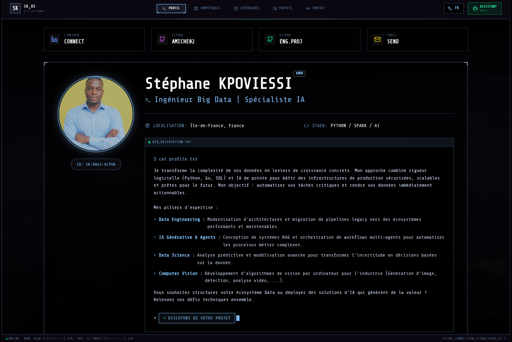

# Stéphane Kpoviessi - Portfolio Projects 🚀

This repository hosts the source code for my professional portfolio website. It includes the latest "Terminal" version, a highly interactive and themed showcase of my skills in Data Engineering and AI.

## 📂 Projects

### [Terminal Portfolio](./terminal_portfolio)
**Current Production Version**
A CLI-themed, interactive React application mimicking a high-tech terminal interface.
*   **Stack**: React, TypeScript, Vite, TailwindCSS, Gemini AI.
*   **Features**: AI Chatbot, Matrix-style animations, Command-line navigation.

### Legacy Versions & Docs
*   `stephanePortfolio/`: Previous iteration of the portfolio.
*   `docs/`: Design documents and assets.

## 📸 Preview

## 👤 Author

**Stéphane Kpoviessi**
*Big Data Engineer | AI Specialist*

*   [LinkedIn](https://linkedin.com/in/stephanekpoviessi)
*   [GitHub](https://github.com/Amiche02)

---
*Structured for performance. Powered by AI.*
