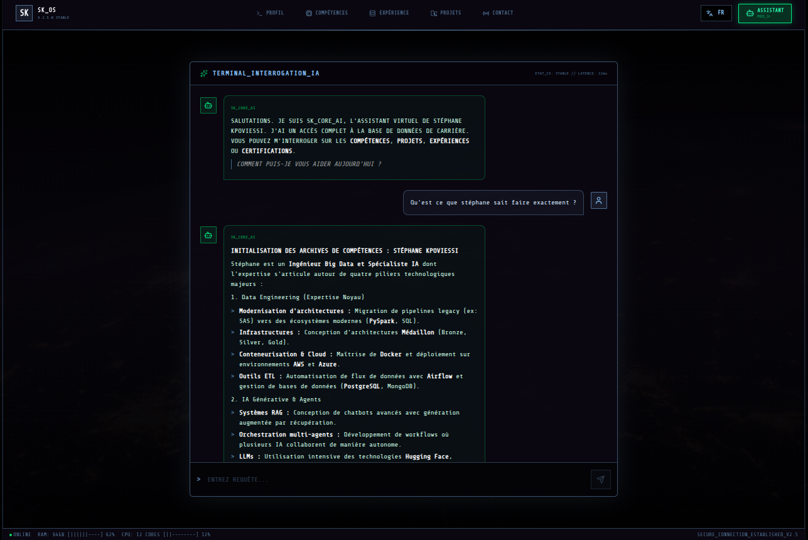
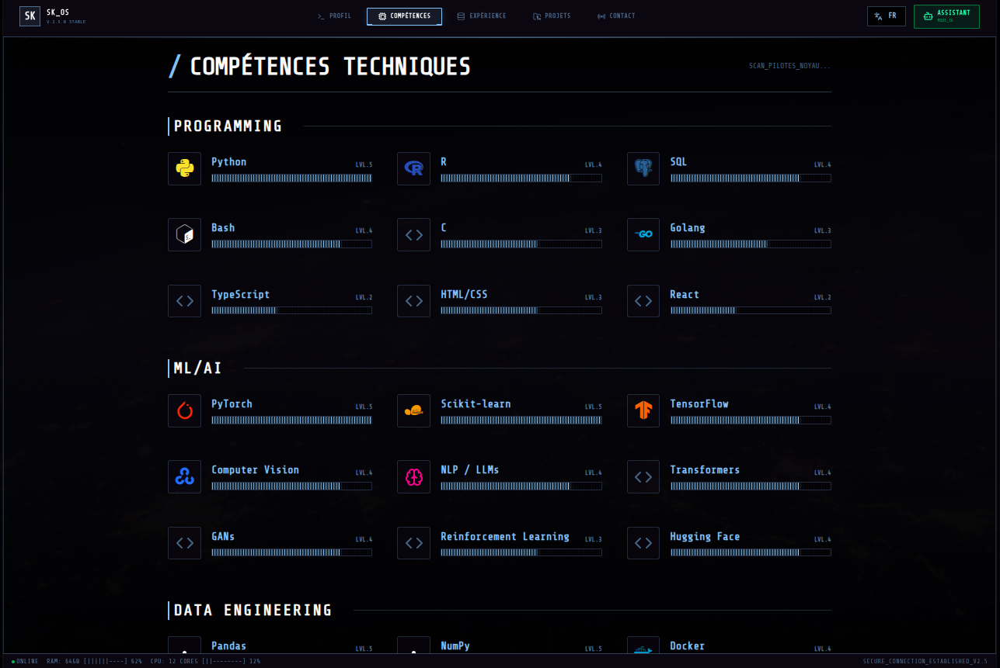
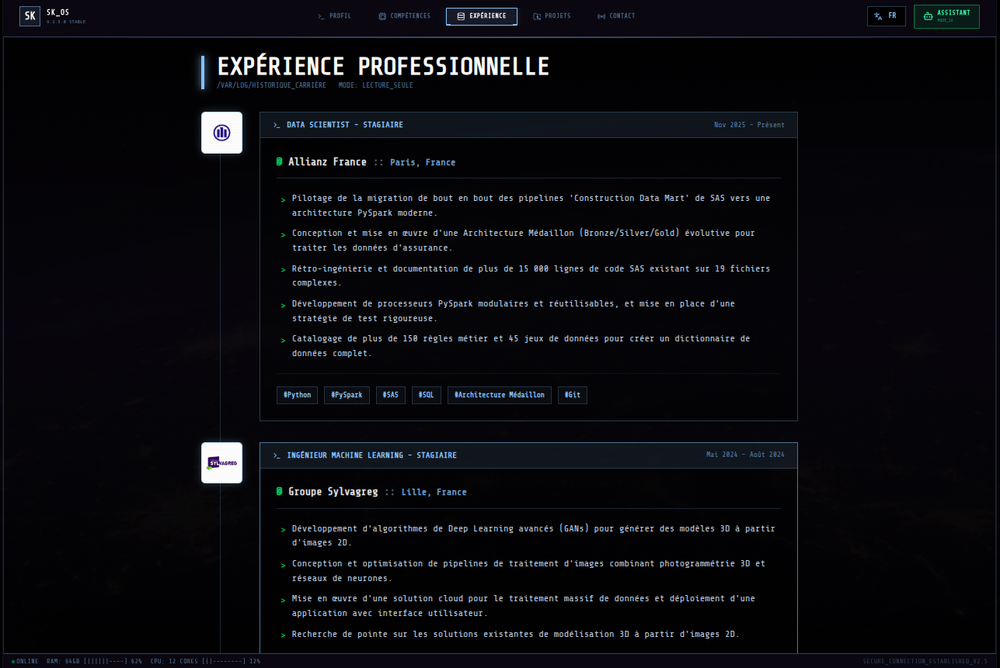
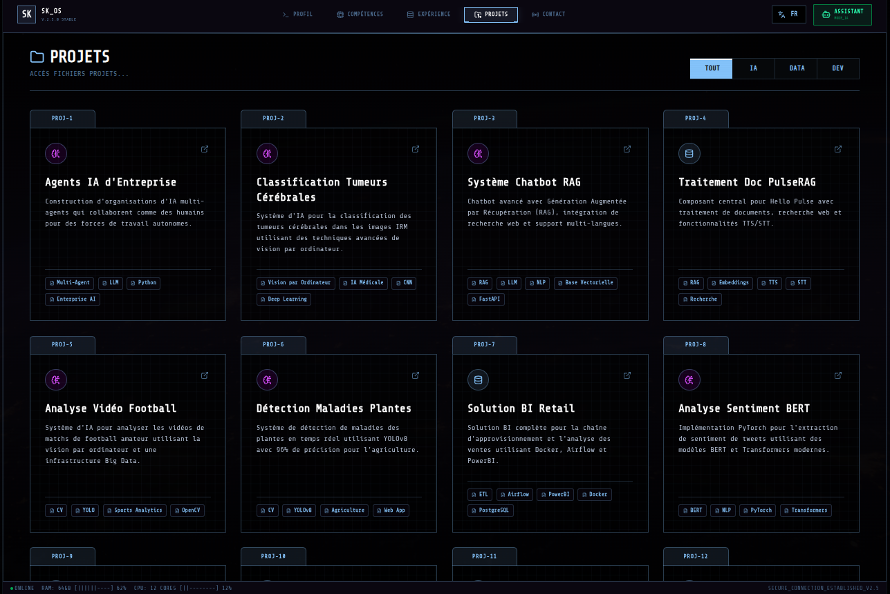
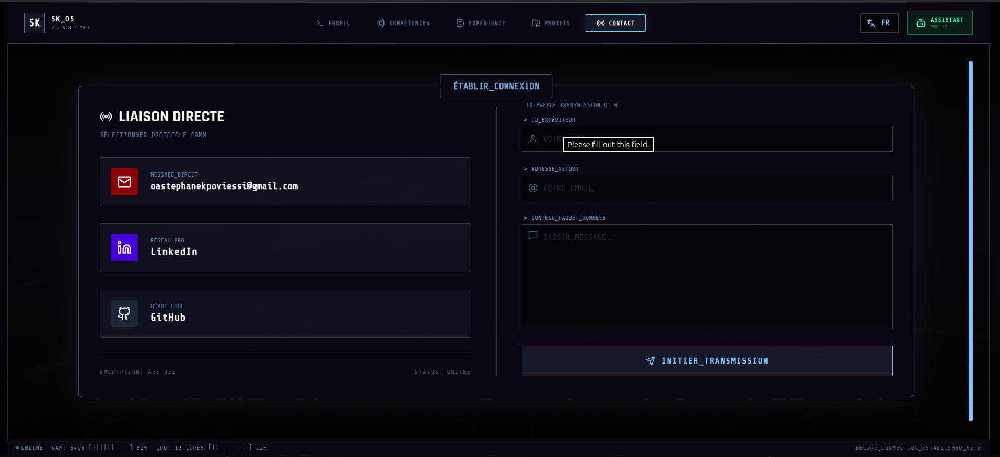

# Terminal Portfolio 🖥️

A specialized, high-performance portfolio interface designed for data engineers and AI specialists. Built with React, TypeScript, and Vite, this application features a unique terminal-inspired aesthetic with advanced interactive elements.

## 📸 Interface Preview

<div align="center">
  
</div>

## 🚀 Key Features

*   **Terminal Aesthetic**: CRT effects, scanlines, and typewriter animations for an immersive experience.
*   **AI Command Center**: Integrated **Gemini AI** chatbot to answer questions about skills and experience.
*   **Interactive Design**: Draggable windows, keyboard navigation, and dynamic command execution.
*   **Multi-Agent Workflow Showcase**: Dedicated sections for AI and Data Engineering projects.
*   **Bilingue / Bilingual**: Full support for English and French (EN/FR).

## 🛠️ Tech Stack

*   **Core**: React 18, TypeScript, Vite
*   **Styling**: Tailwind CSS, Custom CSS Animations
*   **AI Integration**: Google Gemini API via `@google/genai`
*   **Icons**: Lucide React
*   **Markdown Rendering**: `react-markdown` with GFM support

## 📂 Project Structure

```bash
terminal_portfolio/
├── public/             # Static assets (images, icons)
├── src/
│   ├── components/     # React components (Dashboard, SkillTree, AskAI...)
│   ├── data.ts         # Portfolio data (Skills, Projects, Experience)
│   ├── types.ts        # TypeScript definitions
│   └── App.tsx         # Main entry point with routing logic
└── vite.config.ts      # Vite configuration & Alias setup
```

## 🔧 Installation & Setup

1.  **Navigate to the directory**:
    ```bash
    cd terminal_portfolio
    ```

2.  **Install dependencies**:
    ```bash
    npm install
    ```

3.  **Environment Setup**:
    Create a `.env` file in the root of `terminal_portfolio` and add your API keys:
    ```env
    GOOGLE_API_KEY=your_api_key_here
    ```

4.  **Run Development Server**:
    ```bash
    npm run dev
    ```

5.  **Build for Production**:
    ```bash
    npm run build
    ```

## 📸 More Views

### Profile and Chatbot
<div align="center">
  
  
</div>

<div align="center">
  
  
</div>

<div align="center">
  
  
</div>
---
*Acces granted. System Ready._*
